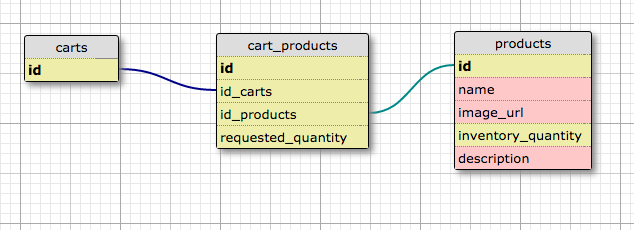

# Robot-Shoppee

## User Stories
User should be able to:
1. view a list of products
2. accumulate a shopping cart of products
3. "buy" shopping cart contents
4. add products to the list of products

Products should be able to:
1. be listed (index)
2. decrease when a user purchases a product
3. increase when a user adds a quantity

## Schema

## Iteration 2
1. Have a quantity in stock for each item and a price.
2. Prices should be displayed in legit format ex: $99.95
3. Have a separate view for inventory administration (add, remove, edit) located at '/admin' User http thing. Username should be admin and password is secret.  Also have this protection for item creation, edit, and deletion.
4. UX for inventory view should be tabular, very functional, designed to help the merchant move through lots of data quickly
5. UX for the shopper's view should be visual, maybe a grid of product images, should encourage spending time and slow browsing.  The links to edit, delete, etc on each product should be hidden in the shoppers view
6. Beautiful, usable, responsive layout.  The site should look decent on a mobile device.  You can use SCSS or SASS for your stylesheets.  utilize the bootstrap framework
7. Include flash error and success messages.  Add styles green for good and red for bad.

## Iteration 3
1. The client wants users. Add user registration and login. There should be an admin user who will have access to the admin console.
2. Rails has_secure_password (bcrypt) is sufficient for the auth.
3. Turns out HTTP Basic Authentication has some flaws. Replace it with session based authentication and authorization with a Users table.
4. Products should be classified into categories. A product can have many categories and a category can have many products. On the home page, have a link that shows all the categories available for selection. When a particular category is clicked, show all products that have that category.
5. A product’s show page should show which categories the product is in
6. Update the tests for categories and for your new authentication scheme.
7. Now that we have users the client wants us to start spamming them constantly. Build an ActionMailer adapter for your app that will send a welcome email when the user signs up.

## Iteration 4
1. When the user clicks checkout, the number of items in stock should be reduced by the amount that was purchased.
2. Upon checkout, redirect the user to a thank you page that indicates what they purchased and how much they spent
3. Maintain an order history for each user and have an “order history” page which shows previous orders, including the date and time the order occurred
4. When a user clicks checkout, they should receive an email detailing the purchase.
5. Users can remove items from the cart
6. Users can add a certain quantity of products to the cart, as long as the quantity in stock is not exceeded.
7. Any items which are out of stock should be indicated as such on the product page and have their ‘Add to cart’ button greyed out.
8. Each product should have an ‘Add to cart’ button which will load a view through AJAX that shows the shopping cart for that user
9. Calculate the total price of items in the cart and have that update with JavaScript when items are added or removed
10. Add tests to ensure the behavior above e.g., when an item is out of stock, the ‘Add to cart’ button is disabled.
11. Add feature tests for the shopping cart itself and tests for any new models you created

## Iteration 5
1. Integrate Travis CI

### Contributing
MIT License. Please contribute! :)
